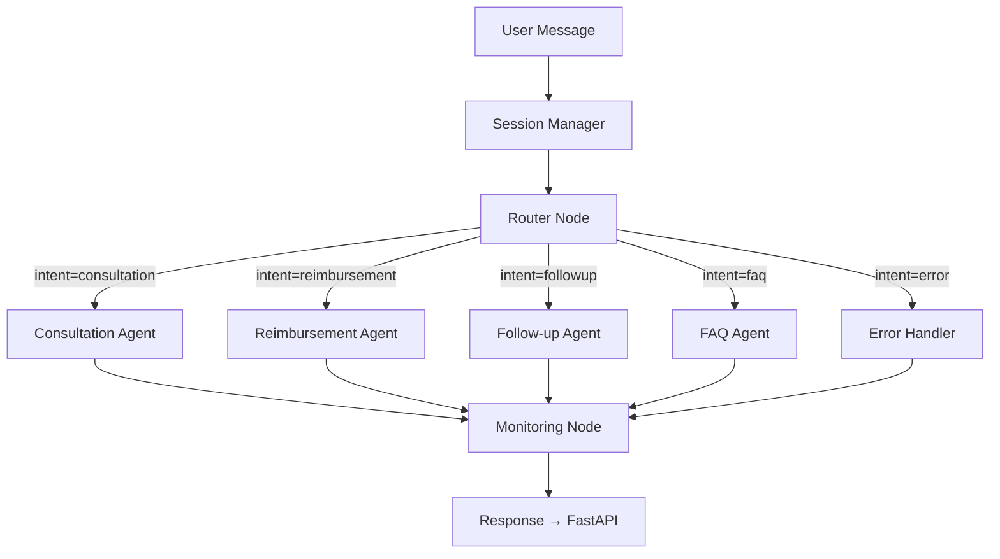

# Agent Card — Healthcare AI Router

This document describes all AI agents in the Healthcare AI Router system, following the [Google Agent Card](https://modelcards.withgoogle.com) format.

---

## Router Agent

| Field | Value |
|---|---|
| **Name** | `RouterAgent` |
| **Role** | Intent classifier and request dispatcher |
| **Model** | Groq `llama3-8b-8192` |
| **Responsibility** | Classify user intent into one of: `consultation`, `reimbursement`, `followup`, `faq`, `error` |
| **Output Schema** | `RouterOutput { intent: str, confidence: float }` |
| **Constraints** | Must NOT answer the user's question. Must NOT contain business logic. |
| **Prompt** | `backend/prompts/router.txt` |

**Graph Position:** Entry node. All requests pass through this agent first.

**Decision Logic:**
```
"consultation" → schedule/book/appointment/specialist/doctor
"reimbursement" → claim/reimburse/coverage/insurance/payment
"followup" → symptom/pain/fever/follow-up/progress/medication
"faq" → what/how/explain/policy/general question
```

---

## Consultation Agent

| Field | Value |
|---|---|
| **Name** | `ConsultationAgent` |
| **Role** | Appointment scheduling assistant |
| **Model** | Groq `llama3-8b-8192` |
| **Responsibility** | Extract appointment details and provide scheduling guidance |
| **Input** | Routed when `intent == "consultation"` |
| **Output Schema** | `ConsultationOutput { answer, patient_name, specialty, city, preferred_date, doctor_preference, urgency_level }` |
| **Prompt** | `backend/prompts/consultation.txt` |

**Structured Output Fields:**

| Field | Type | Description |
|---|---|---|
| `answer` | `str` | Natural language response to the user |
| `patient_name` | `str \| None` | Extracted patient name |
| `specialty` | `str \| None` | Medical specialty requested |
| `city` | `str \| None` | Preferred city |
| `preferred_date` | `str \| None` | Preferred appointment date |
| `doctor_preference` | `str \| None` | Preferred doctor name |
| `urgency_level` | `low \| medium \| high` | Urgency classification |

---

## Reimbursement Agent

| Field | Value |
|---|---|
| **Name** | `ReimbursementAgent` |
| **Role** | Insurance claims and reimbursement specialist |
| **Model** | Groq `llama3-8b-8192` |
| **Responsibility** | Guide users through insurance claim filing and coverage inquiries |
| **Input** | Routed when `intent == "reimbursement"` |
| **Output Schema** | `ReimbursementOutput { answer, coverage, delay, required_documents, steps, claim_type }` |
| **Prompt** | `backend/prompts/reimbursement.txt` |

**Structured Output Fields:**

| Field | Type | Description |
|---|---|---|
| `answer` | `str` | Natural language response |
| `coverage` | `str` | Coverage type description |
| `delay` | `str` | Estimated processing time |
| `required_documents` | `list[str]` | Required supporting documents |
| `steps` | `list[str]` | Step-by-step filing instructions |
| `claim_type` | `str \| None` | Type of claim being filed |

---

## Follow-up Agent

| Field | Value |
|---|---|
| **Name** | `FollowupAgent` |
| **Role** | Post-treatment symptom monitoring and care advisor |
| **Model** | Groq `llama3-8b-8192` |
| **Responsibility** | Assess reported symptoms and provide care guidelines |
| **Input** | Routed when `intent == "followup"` |
| **Output Schema** | `FollowupOutput { answer, symptoms, recommendations, requires_urgent_care, next_appointment_suggestion }` |
| **Prompt** | `backend/prompts/followup.txt` |

**Structured Output Fields:**

| Field | Type | Description |
|---|---|---|
| `answer` | `str` | Natural language response |
| `symptoms` | `list[str]` | Identified symptoms |
| `recommendations` | `list[str]` | Care guidelines |
| `requires_urgent_care` | `bool` | Whether emergency care is needed |
| `next_appointment_suggestion` | `str \| None` | Follow-up appointment suggestion |

> ⚠️ **Safety:** The agent always adds a disclaimer that this is informational only and not a medical diagnosis.

---

## FAQ Agent

| Field | Value |
|---|---|
| **Name** | `FAQAgent` |
| **Role** | General healthcare information assistant |
| **Model** | Groq `llama3-8b-8192` |
| **Responsibility** | Answer general health policy, procedure, and informational questions |
| **Input** | Routed when `intent == "faq"` |
| **Output Schema** | `FAQOutput { answer, category, sources_note, confidence }` |
| **Prompt** | `backend/prompts/faq.txt` |

**Structured Output Fields:**

| Field | Type | Description |
|---|---|---|
| `answer` | `str` | Natural language response |
| `category` | `str` | FAQ category (e.g. "medication", "policy") |
| `sources_note` | `str \| None` | Source caveat or recommendation |
| `confidence` | `float` | Agent's confidence in the answer (0–1) |

---

## Monitoring Agent

| Field | Value |
|---|---|
| **Name** | `MonitoringAgent` |
| **Role** | Telemetry writer (non-AI node) |
| **Responsibility** | Write execution trace records to MongoDB |
| **Input** | Always runs after specialized agent, regardless of intent |
| **Output** | `MonitoringLog` persisted to `telemetry` collection |

**No LLM call** — this is a deterministic Python node that collects metadata from the graph state and writes it to the database.

---

## Agent Interaction Flow


